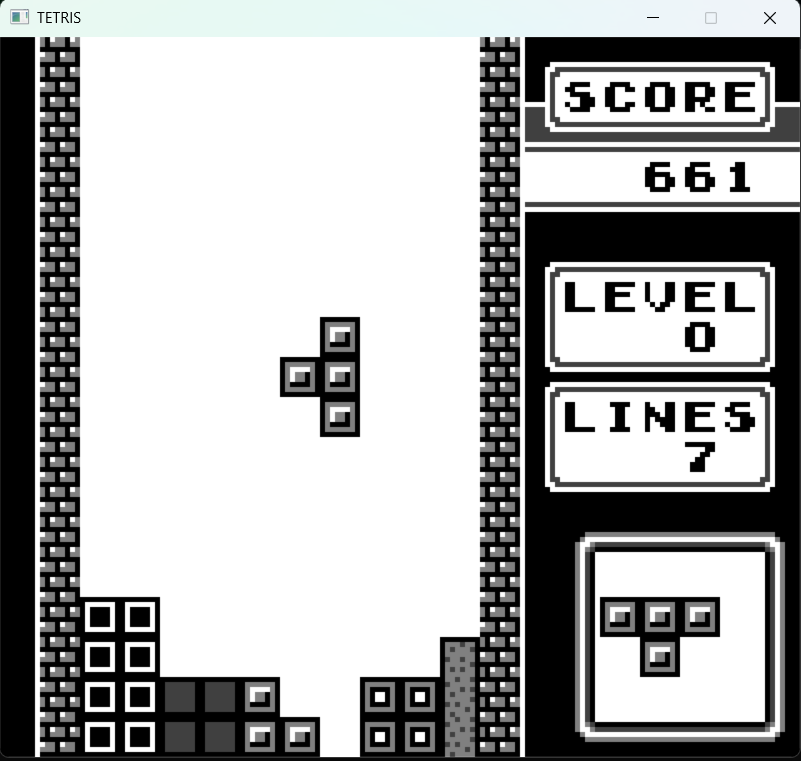
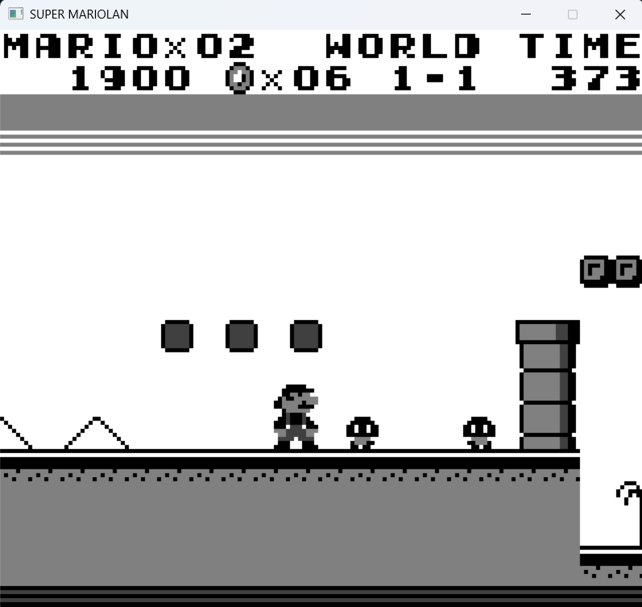
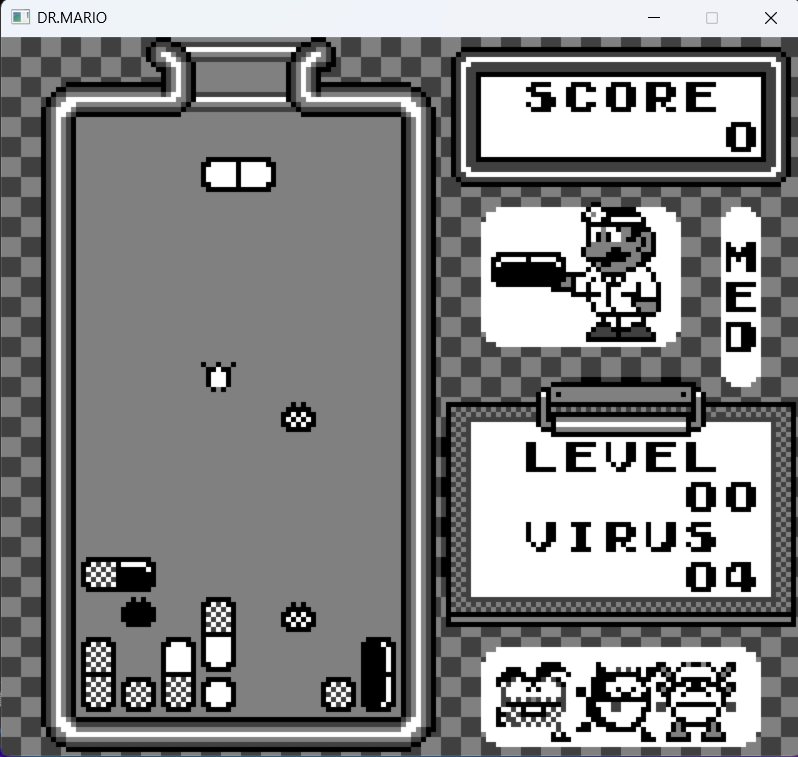

## Hamboy
Hamboy is a Game Boy (DMG) emulator written in C++ and running on SDL2. Hamboy is still under development.

## Latest Update - 0.51
* Fixed issue with jittery horizontal scrolling
* Fixed issue with internal timer breaking some game features
* Fixed issue with MBC3 support
* Fixed issue with RTC
* Fixed issue with framerate not correctly targeting 60 FPS

## Current Features
* LR35902 CPU Implementation
* Basic PPU rendering
* Swappable Memory Banks
* SDL2 keyboard input
* Real Time Clock

## Future Updates
* Audio implementation
* Configurable key mapping
* Configurable screen size / scaling
* ROM loading through a UI instead of command line
* Save states
* Battery saves

## Download (Windows)
Grab the latest release here:
https://github.com/ElricWilder/Hamboy/releases/tag/v0.51
Included in the ZIP:
* Hamboy.exe (Release build)
* SDL2.dll
* README.txt

## Screenshots






## Building From Source

Requirements:
* C++20 compiler
* CMake 3.20+
* Ninja (recommended)
* SDL2 (via vcpkg)

Windows (Visual Studio + vcpkg)
Install SDL2: 
```
vcpkg install sdl2:x64-windows
vcpkg install sdl2:x64-windows-release
```

Enable vcpkg integration:
```
vcpkg integrate install
```
Build:
```
cmake -S . -B build -DCMAKE_BUILD_TYPE=Release
cmake --build build --config Release
```
Executable will appear in:
```
out/build/x64-Release/Hamboy.exe
```

## Why I chose This Project
I chose to build a Game Boy emulator as a way to learn more about emulation concepts while building programming skills, especially in C++. 
I previously completed a <a href="https://github.com/ElricWilder/CHIP-8-Emulator" target="_blank" rel="noopener noreferrer">CHIP-8 emulator</a>.

## Resources I Used

- **Pan Docs**  
  https://gbdev.io/pandocs/

- **izik1 Opcode Table**  
  https://izik1.github.io/gbops/

- **aquova's gb-book Project**  
  https://github.com/aquova/gb-book/tree/master

- **GB: Complete Technical Reference**  
  https://github.com/Gekkio/gb-ctr

- **Gameboy Doctor**  
  https://github.com/robert/gameboy-doctor

- **Blargg's Test ROMs**  
  https://github.com/retrio/gb-test-roms

- **Mooneye Test Suite**  
  https://github.com/Gekkio/mooneye-test-suite/

